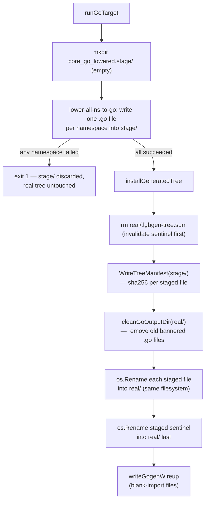

## Problem

`lgbgen --target=go` re-lowers every eligible namespace's `defn`/`defmulti`
forms through the [ir pipeline](ir-pipeline.md) and writes the result as Go
source under `pkg/rt/core_go_lowered/`, which a `-tags gogen_ir` build then
compiles against. Lowering the whole program (typeinfer included) takes
minutes.

Before this change, `runGoTarget` deleted `core_go_lowered/`'s previously
generated files and wrote the new tree in place. Any interruption during
that multi-minute window — a killed process, a crash, a machine restart —
left a **torn** tree: some packages present, others missing or from a stale
generation. That state is invisible to `git`/`jj status` (the directory is
gitignored) and only manifests later as a wall of `no required module
provides package …` errors from `go build -tags gogen_ir`, repairable only
by re-running the full multi-minute regeneration. This repeatedly broke the
pre-push gate (issue #429).

## Mechanism

`runGoTarget` (in `cmd/lgbgen/main.go`) now generates into a **staging
sibling** directory, `core_go_lowered.stage/`, and only swaps it into place
on success:

Key properties:

- **Hermetic staging.** `core_go_lowered.stage/` starts empty every run
  (`os.RemoveAll` then `os.MkdirAll`), so an orphaned package from a
  renamed/removed namespace can never survive into the new generation by
  accident.
- **Failure is side-effect-free on the real tree.** If any namespace fails
  to lower, `runGoTarget` exits before `installGeneratedTree` is ever
  called — the previous, consistent `core_go_lowered/` is left exactly as
  it was.
- **Per-file rename, not a directory swap.** `installGeneratedTree` walks
  the staged tree and calls `os.Rename` for each file into `real/`,
  because stage and real are sibling directories on the same filesystem
  (cheap, near-instant). This shrinks the window during which the tree can
  be observed as inconsistent from the whole multi-minute lowering down to
  the duration of this rename loop (milliseconds).
- **Completeness sentinel (`.lgbgen-tree.sum`).** [`pkg/genmanifest`](generated-artifacts.md)
  writes a manifest of every generated file's sha256 (`WriteTreeManifest`),
  computed from the **stage** dir (so it lists exactly what this generation
  wrote, not whatever else lives in `real/`). The sentinel is:
  - **removed first**, before any install work touches `real/`, so a crash
    mid-install leaves no sentinel — the tree reads as "incomplete";
  - **installed last**, via its own rename, only once every other file has
    landed.
  `genmanifest.CheckTreeManifest(dir)` lets a consumer (e.g.
  `TestGogenAOTDiff`) positively verify the tree is complete before
  building `-tags gogen_ir`: missing sentinel or any checksum mismatch is a
  hard, fast (~0.01s) failure with an actionable message ("run `make
  generate`") instead of a confusing cascade of Go module errors.
- **Co-tenant tolerance.** `CheckTreeManifest` only verifies files *listed*
  in the manifest — it no longer flags unlisted files as errors. Other
  tools (e.g. `scripts/gogen-trampoline.lg`, which lowers test fixtures
  into the same directory so their module imports resolve) may legitimately
  add files to `core_go_lowered/` whose lifecycle the sentinel doesn't own.

`.gitignore` was extended to ignore `pkg/rt/core_go_lowered.stage/` so any
residue from an interrupted run never gets committed.

## Why here, not in the build script

The stage/swap logic lives inside `runGoTarget`, the single point where
both `--target=go` and `--target=both` converge, rather than in
`scripts/generate.lg`. Every caller — `make generate`, `make lowered`,
`make check-generated` — gets the same crash-safety for free.

## Related

- [Generated artifacts](generated-artifacts.md) — the broader `.lgb`
  bundle / lowered-Go-tree generation pipeline this hardens.
- [Go backend](go-backend.md) — what the lowered Go source actually looks
  like and how it's wired in under `-tags gogen_ir`.
- [Self-hosting AOT](../ideas/self-hosting-aot.md) — the roadmap this
  reliability work supports (lgbgen self-hosts by lowering its own
  dependency passes).
